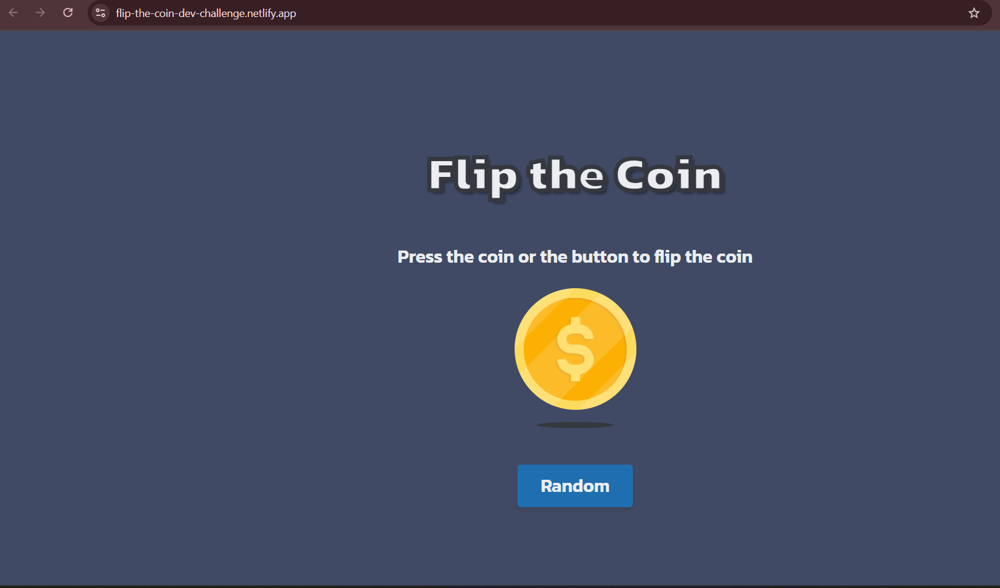

<h1 align="center">Flip the Coin | devChallenges</h1>

   Solution for a challenge <a href="https://devchallenges.io/challenge/flip-the-coin" target="_blank">Flip The Coin</a> from <a href="http://devchallenges.io" target="_blank">devChallenges.io</a>.

  <h3>
    <a href="https://flip-the-coin-dev-challenge.netlify.app/" target="blank">
      Demo
    </a>
     | 
    <a href="https://github.com/bandgeekdev/flip-the-coin-dev-challenge">
      Solution
    </a>
     | 
    <a href="https://devchallenges.io/challenge/flip-the-coin">
      Challenge
    </a>
  </h3>

## Table of Contents

- [Overview](#overview)
- [What I learned](#what-i-learned)
- [Useful resources](#useful-resources)
- [Built with](#built-with)
- [Features](#features)
- [Acknowledgements](#acknowledgements)

<!-- OVERVIEW -->

## Overview

Flip the Coin is a simple web application that lets users flip a virtual coin by clicking either the coin image or a button. Each flip randomly displays "Heads" or "Tails" and updates the coin graphic accordingly. The project demonstrates the use of semantic HTML, modern CSS (including custom fonts and responsive design), and JavaScript for interactive DOM manipulation. It was built as a solution to the Flip the Coin challenge

### What I learned

- How to correctly include a stylesheet and JavaScript file.
- That I can set a script tag to defer when I want the DOM to be loaded before it renders the page. This enhances performance.
- That you have to be consistent with naming ids and classes. This also helped me learn a bit about troubleshooting JavaScript.
- How to use relative paths from local images.
- How to create a text outline stroke to enhance my title.
- The markdown image syntax.

### Useful resources

- I used [Google Fonts](https://fonts.google.com/) to select and embed the "Kanit" font for the page.
- I used [Netlify](https://app.netlify.com/) to host the site and make it accessible to users.

### Built with

- Semantic HTML5 markup
- CSS custom properties
- Flexbox
- CSS Grid

## Features

- Flip a virtual coin by clicking the button or image of the coin.
- Displays a result of heads or tails after each flip.
- Updates coin image based on the result.
- Responsive UI.
- Custom styles and fonts for a modern look.
- Simple and intuitive UX.

This application/site was created as a submission to a [DevChallenges](https://devchallenges.io/challenges-dashboard) challenge.

## Acknowledgements

### Thanks to:

- [GitHub Copilot](https://github.com/features/copilot) for coding assistance and explanations.
- [ChatGPT](https://openai.com/chatgpt) by OpenAI for guidance on project structure, JavaScript logic, and DOM manipulation strategies.
- [DevChallenges.io](https://devchallenges.io) for the original project prompt.

## Author

- GitHub [@bandgeekdev](https://github.com/bandgeekdev)
